to view http://htmlpreview.github.io
To run r code
**shortcut is ctrl+alt+i**


# Introduction


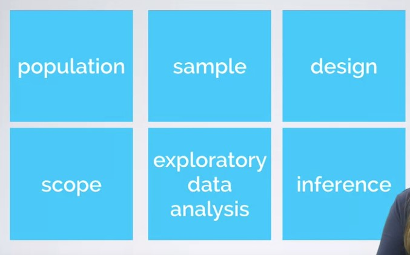
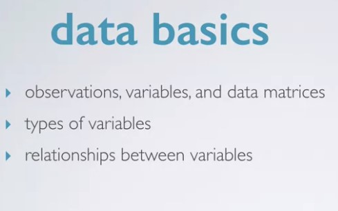
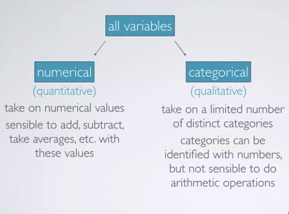
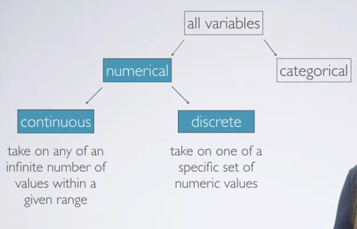
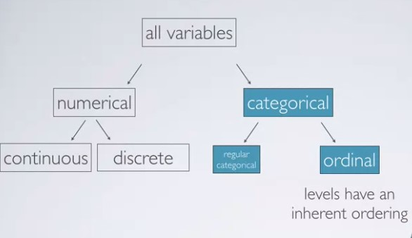

**discrete numerical variable**: An accounted veriable that can only take on whole number values

**continuous numerical variable**: it can take on any number of values between two set of numbers

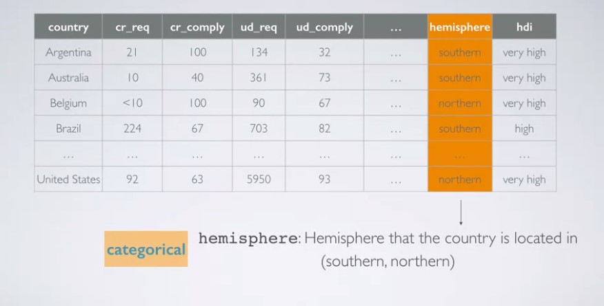

*hdi* is an **ordinal categorical variable**

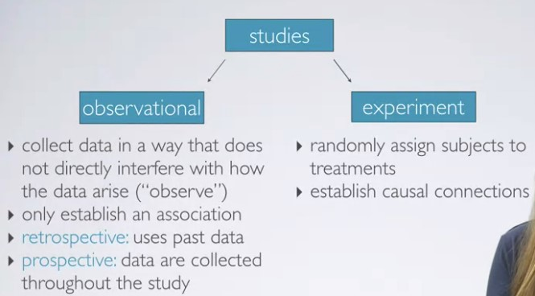
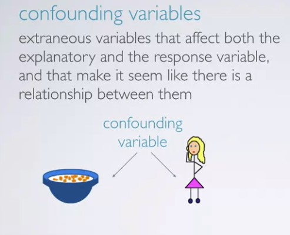
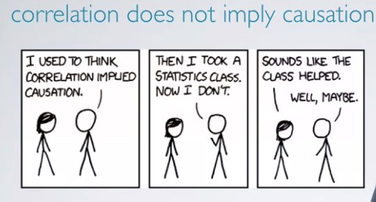

# Sampling & sources of bias

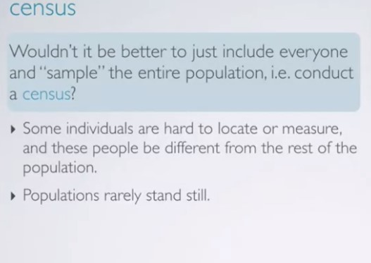
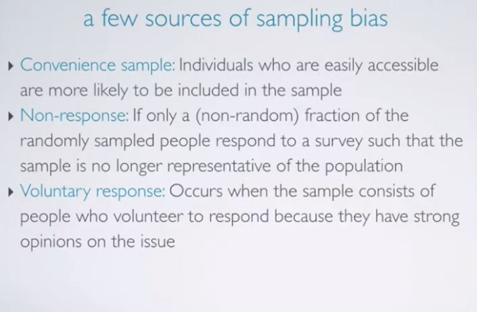
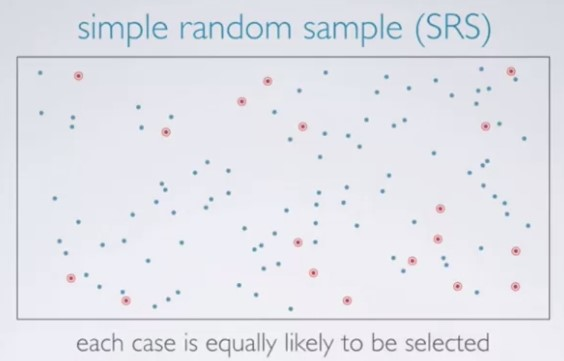
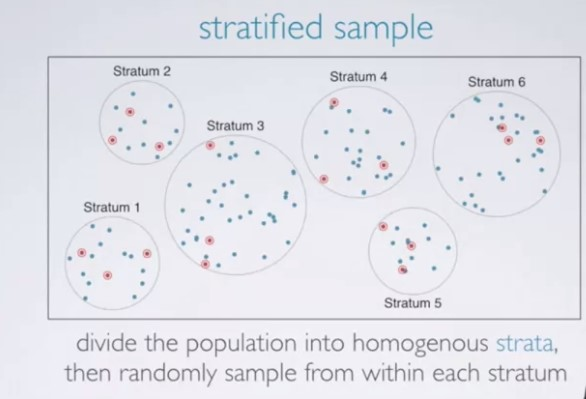
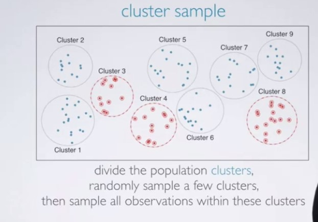
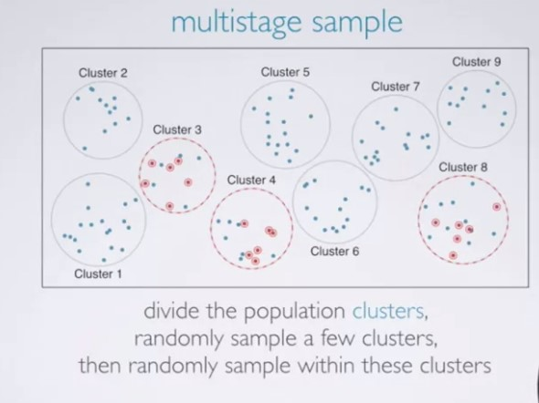

# Experimental Design

Principles of experimental design


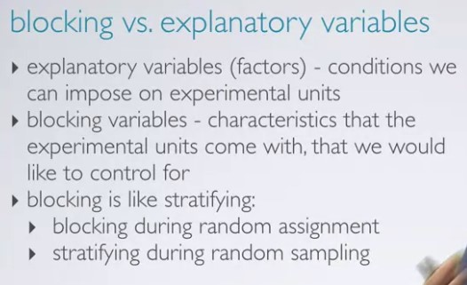


# Random Sample Assignment

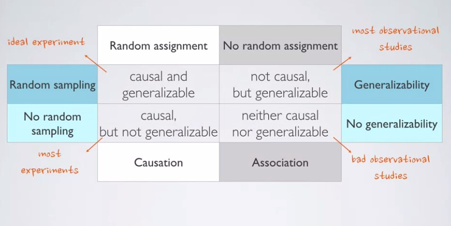

**quiz**

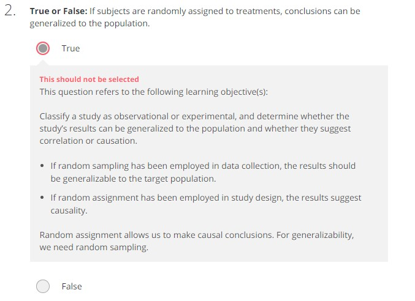

**Shortcuts**

piping operator: ctrl + shift + m

assign operator: alt + -

# Assignment

```{r}
library(dplyr)
library(ggplot2)
library(statsr)
```


```{r}
data(arbuthnot)
dim(arbuthnot)
names(arbuthnot)
arbuthnot$boys
ggplot(data = arbuthnot, aes(x = year, y = girls)) +
  geom_point()
arbuthnot <- arbuthnot %>%
  mutate(total = boys + girls)
ggplot(data = arbuthnot, aes(x = year, y = total)) +
  geom_line()
ggplot(data = arbuthnot, aes(x = year, y = total)) +
  geom_line() +
  geom_point()
arbuthnot <- arbuthnot %>%
  mutate(more_boys = boys > girls)
```

```{r}
data(present)
dim(present)
```

Calculate the total number of births for each year and store these values in a new variable called total in the  present dataset. Then, calculate the proportion of boys born each year and store these values in a new variable called prop_boys in the same dataset. Plot these values over time and based on the plot determine if the following statement is true or false: The proportion of boys born in the US has decreased over time.
True
False
```{r}
present <- present %>% 
mutate(total = boys + girls)%>% 
mutate(prop_boys = boys/total)

ggplot(data = present, aes(x = year, y = prop_boys)) + geom_line()
```


