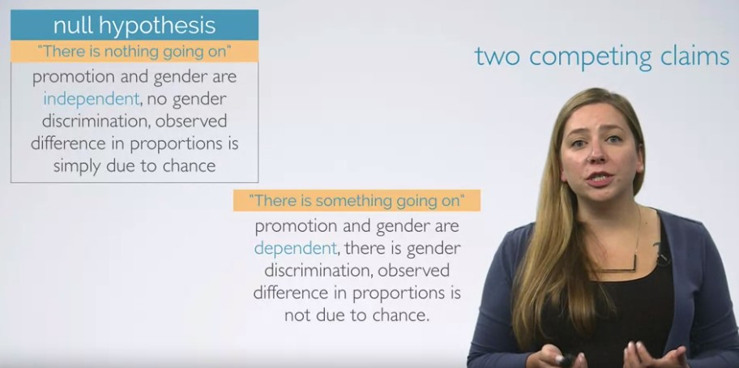

to view http://htmlpreview.github.io
To run r code
**shortcut is ctrl+alt+i**


# Introduction


**discrete numerical variable**: An accounted veriable that can only take on whole number values

**continuous numerical variable**: it can take on any number of values between two set of numbers


*hdi* is an **ordinal categorical variable**


# Sampling & sources of bias


# Experimental Design

Principles of experimental design


# Random Sample Assignment


**quiz**


**Shortcuts**

piping operator: ctrl + shift + m

assign operator: alt + -

# Assignment

```{r}
library(dplyr)
library(ggplot2)
library(statsr)
```


```{r}
data(arbuthnot)
dim(arbuthnot)
names(arbuthnot)
arbuthnot$boys
ggplot(data = arbuthnot, aes(x = year, y = girls)) +
  geom_point()
arbuthnot <- arbuthnot %>%
  mutate(total = boys + girls)
ggplot(data = arbuthnot, aes(x = year, y = total)) +
  geom_line()
ggplot(data = arbuthnot, aes(x = year, y = total)) +
  geom_line() +
  geom_point()
arbuthnot <- arbuthnot %>%
  mutate(more_boys = boys > girls)
```

```{r}
data(present)
dim(present)
```

Calculate the total number of births for each year and store these values in a new variable called total in the  present dataset. Then, calculate the proportion of boys born each year and store these values in a new variable called prop_boys in the same dataset. Plot these values over time and based on the plot determine if the following statement is true or false: The proportion of boys born in the US has decreased over time.

True

False
```{r}
present <- present %>% 
mutate(total = boys + girls)%>% 
mutate(prop_boys = boys/total)

ggplot(data = present, aes(x = year, y = prop_boys)) + geom_line()
```

Create a new variable called more_boys which contains the value of either TRUE if that year had more boys than girls, or FALSE if that year did not. Based on this variable which of the following statements is true?

Every year there are more girls born than boys.

Every year there are more boys born than girls.

Half of the years there are more boys born, and the other half more girls born.

```{r}
present <- present %>%
mutate(more_boys = boys > girls)

ggplot(data = present, aes(x = year, y = more_boys)) + geom_line()
```


Calculate the boy-to-girl ratio each year, and store these values in a new variable called prop_boy_girl in the  present dataset. Plot these values over time. Which of the following best describes the trend?

There appears to be no trend in the boy-to-girl ratio from 1940 to 2013.

There is initially an increase in boy-to-girl ratio, which peaks around 1960. After 1960 there is a decrease in the boy-to-girl ratio, but the number begins to increase in the mid 1970s.

There is initially a decrease in the boy-to-girl ratio, and then an increase between 1960 and 1970, followed by a decrease.
The boy-to-girl ratio has increased over time.

There is an initial decrease in the boy-to-girl ratio born but this number appears to level around 1960 and remain constant since then.

```{r}
present <- present %>%
mutate(prop_boy_girl = boys/girls)

ggplot(data = present, aes(x = year, y = prop_boy_girl)) + geom_line()
```


# Week 2: Visualizing numerical data


**Measures of Center**


shows marginal distribution(width of the bars)




**Some Codes**

A very useful function for taking a quick peek at your data frame, and viewing
its dimensions and data types is `str`, which stands for **str**ucture.

The `dplyr` package offers seven verbs (functions) for basic data 
manipulation:

- `filter()`
- `arrange()`
- `select()` 
- `distinct()`
- `mutate()`
- `summarise()`
- `sample_n()`

Quiz

The `nycflights` data frame is a massive trove of information. Let's think about 
some questions we might want to answer with these data:

- We might want to find out how delayed flights headed to a particular 
destination tend to be. 
- We might want to evaluate how departure delays vary over months. 
- Or we might want to determine which of the three major NYC airports has a better 
on time percentage for departing flights.

```{r load-packages, message=FALSE}
library(statsr)
library(dplyr)
library(ggplot2)
```

```{r load-data}
data(nycflights)
```

```{r names}
names(nycflights)
```

```{r str}
str(nycflights)
```

## Analysis

### Departure delays in flights to Raleigh-Durham (RDU)

We can examine the distribution of departure delays of all flights with a 
histogram.

```{r hist-dep-delay}
ggplot(data = nycflights, aes(x = dep_delay)) +
  geom_histogram()
```


Histograms are generally a very good way to see the shape of a single 
distribution, but that shape can change depending on how the data is split 
between the different bins. You can easily define the binwidth you want to use:

```{r hist-dep-delay-bins}
ggplot(data = nycflights, aes(x = dep_delay)) +
  geom_histogram(binwidth = 15)
ggplot(data = nycflights, aes(x = dep_delay)) +
  geom_histogram(binwidth = 150)
```


If we want to focus on departure delays of flights headed to RDU only, we need to
first `filter` the data for flights headed to RDU (`dest == "RDU"`) and then make
a histogram of only departure delays of only those flights.

```{r rdu-flights-hist}
rdu_flights <- nycflights %>%
  filter(dest == "RDU")
ggplot(data = rdu_flights, aes(x = dep_delay)) +
  geom_histogram()
```

Let's decipher these three lines of code:

- Line 1: Take the `nycflights` data frame, `filter` for flights headed to RDU, and 
save the result as a new data frame called `rdu_flights`.
    + `==` means "if it's equal to".
    + `RDU` is in quotation marks since it is a character string.
- Line 2: Basically the same `ggplot` call from earlier for making a histogram, 
except that it uses the data frame for flights headed to RDU instead of all
flights.

**Logical operators: ** Filtering for certain observations (e.g. flights from a 
particular airport) is often of interest in data frames where we might want to 
examine observations with certain characteristics separately from the rest of 
the data. To do so we use the `filter` function and a series of 
**logical operators**. The most commonly used logical operators for data 
analysis are as follows:

- `==` means "equal to"
- `!=` means "not equal to"
- `>` or `<` means "greater than" or "less than"
- `>=` or `<=` means "greater than or equal to" or "less than or equal to"

Note that in the `summarise` function we created a list of two elements. The 
names of these elements are user defined, like `mean_dd`, `sd_dd`, `n`, and 
you could customize these names as you like (just don't use spaces in your 
names). Calculating these summary statistics also require that you know the 
function calls. Note that `n()` reports the sample size.

**Summary statistics: ** Some useful function calls for summary statistics for a 
single numerical variable are as follows:

- `mean`
- `median`
- `sd`
- `var`
- `IQR`
- `range`
- `min`
- `max`

```{r rdu-flights-summ}
rdu_flights %>%
  summarise(mean_dd = mean(dep_delay), sd_dd = sd(dep_delay), n = n())
```

We can also filter based on multiple criteria. Suppose we are interested in
flights headed to San Francisco (SFO) in February:

```{r}
sfo_feb_flights <- nycflights %>%
  filter(dest == "SFO", month == 2)
sfo_feb_flights
```

Note that we can separate the conditions using commas if we want flights that
are both headed to SFO **and** in February. If we are interested in either
flights headed to SFO **or** in February we can use the `|` instead of the comma.

1. Create a new data frame that includes flights headed to SFO in February, and save 
this data frame as `sfo_feb_flights`. How many flights meet these criteria? 
<ol>
<li> 68 </li> 
<li> 1345 </li> 
<li> 2286 </li> 
<li> 3563 </li>
<li> 32735 </li>
</ol>

```{r sfo-feb-flights}
# type your code for Question 1 here, and Knit
sfo_feb_flights <- nycflights %>%
  filter(dest == "SFO" , month == 2)
```


2. Make a histogram and calculate appropriate summary statistics for **arrival** 
delays of `sfo_feb_flights`. Which of the following is false? 
<ol>
<li> The distribution is unimodal. </li> 
<li> The distribution is right skewed. </li> 
<li> No flight is delayed more than 2 hours. </li> 
<li> The distribution has several extreme values on the right side. </li>
<li> More than 50% of flights arrive on time or earlier than scheduled. </li>
</ol>

```{r sfo-feb-flights-arrival-delays}
# type your code for Question 2 here, and Knit
ggplot(data = sfo_feb_flights, aes(x = arr_delay)) +
  geom_histogram()
sfo_feb_flights %>% 
  summarise(mead_arr = mean(arr_delay), sd_arr = sd(arr_delay), n = n())

```

Another useful functionality is being able to quickly calculate summary 
statistics for various groups in your data frame. For example, we can modify the 
above command using the `group_by` function to get the same summary stats for 
each origin airport:

```{r summary-custom-list-origin}
rdu_flights %>%
  group_by(origin) %>%
  summarise(mean_dd = mean(dep_delay), sd_dd = sd(dep_delay), n = n())
```

Here, we first grouped the data by `origin`, and then calculated the summary 
statistics.

3.  Calculate the median and interquartile range for `arr_delay`s of flights in the 
`sfo_feb_flights` data frame, grouped by carrier. Which carrier has the hights 
IQR of arrival delays? 
<ol>
<li> American Airlines </li> 
<li> JetBlue Airways </li> 
<li> Virgin America </li> 
<li> Delta and United Airlines </li>
<li> Frontier Airlines </li>
</ol>

```{r sfo-feb-flights-arrival-delays-carrier}
# type your code for Question 3 here, and Knit
sfo_feb_flights %>% 
  group_by(carrier) %>% 
  summarise(median_arr = median(arr_delay), iqr_arr = IQR(arr_delay),n = n())
```

4.  Which month has the highest average departure delay from an NYC airport? 
<ol>
<li> January </li> 
<li> March </li> 
<li> July </li> 
<li> October </li>
<li> December </li>
</ol>

```{r highest-avg-dep-delay-month}
# type your code for Question 4 here, and Knit
nycflights %>%
  group_by(month) %>%
  summarise(mean_dd = mean(dep_delay)) %>%
  arrange(desc(mean_dd))
```


5.  Which month has the highest median departure delay from an NYC airport?
<ol>
<li> January </li> 
<li> March </li> 
<li> July </li> 
<li> October </li>
<li> December </li>
</ol>

```{r highest-median-dep-delay-month}
# type your code for Question 5 here, and Knit
nycflights %>%
  group_by(month) %>%
  summarise(median_dd = median(dep_delay)) %>%
  arrange(desc(median_dd))
```

6.  Is the mean or the median a more reliable measure for deciding which month(s) to 
avoid flying if you really dislike delayed flights, and why? 
<ol>
<li> Mean would be more reliable as it gives us the true average. </li> 
<li> Mean would be more reliable as the distribution of delays is symmetric. </li> 
<li> Median would be more reliable as the distribution of delays is skewed. </li> 
<li> Median would be more reliable as the distribution of delays is symmetric. </li>
<li> Both give us useful information. </li>
</ol>


We can also visualize the distributions of departure delays across months using 
side-by-side box plots:

```{r delay-month-box}
ggplot(nycflights, aes(x = factor(month), y = dep_delay)) +
  geom_boxplot()
```

### On time departure rate for NYC airports

Suppose you will be flying out of NYC and want to know which of the 
three major NYC airports has the best on time departure rate of departing flights. 
Suppose also that for you a flight that is delayed for less than 5 minutes is 
basically "on time". You consider any flight delayed for 5 minutes of more to be 
"delayed".

In order to determine which airport has the best on time departure rate, 
we need to 

- first classify each flight as "on time" or "delayed",
- then group flights by origin airport,
- then calculate on time departure rates for each origin airport,
- and finally arrange the airports in descending order for on time departure
percentage.

Let's start with classifying each flight as "on time" or "delayed" by
creating a new variable with the `mutate` function.

```{r dep-type}
nycflights <- nycflights %>%
  mutate(dep_type = ifelse(dep_delay < 5, "on time", "delayed"))
```

The first argument in the `mutate` function is the name of the new variable
we want to create, in this case `dep_type`. Then if `dep_delay < 5` we classify 
the flight as `"on time"` and `"delayed"` if not, i.e. if the flight is delayed 
for 5 or more minutes.

Note that we are also overwriting the `nycflights` data frame with the new 
version of this data frame that includes the new `dep_type` variable.

We can handle all the remaining steps in one code chunk:

```{r}
nycflights %>%
  group_by(origin) %>%
  summarise(ot_dep_rate = sum(dep_type == "on time") / n()) %>%
  arrange(desc(ot_dep_rate))
```

**The summarise step is telling R to count up how many records of the currently found group are on time - sum(dep_type == "on time”) - and divide that result by the total number of elements in the currently found group - n() - to get a proportion, then to store the answer in a new variable called ot_dep_rate.**

7.  If you were selecting an airport simply based on on time departure percentage, 
which NYC airport would you choose to fly out of? 
<ol>
<li> EWR </li> 
<li> JFK </li> 
<li> LGA </li> 
</ol>

```{r on-time-dep-perc-airport}
# type your code for Question 7 here, and Knit
nycflights %>%
  group_by(origin) %>%
  summarise(ot_dep_rate = sum(dep_type == "on time") / n()) %>%
  arrange(desc(ot_dep_rate))
```

We can also visualize the distribution of on on time departure rate across 
the three airports using a segmented bar plot.

```{r}
ggplot(data = nycflights, aes(x = origin, fill = dep_type)) +
  geom_bar()
```

8.  Mutate the data frame so that it includes a new variable that contains the 
average speed, `avg_speed` traveled by the plane for each flight (in mph). What is 
the tail number of the plane with the fastest `avg_speed`? **Hint:** Average speed 
can be calculated as distance divided by number of hours of travel, and note that 
`air_time` is given in minutes. If you just want to show the `avg_speed` and 
`tailnum` and none of the other variables, use the select function at the end of your 
pipe to select just these two variables with `select(avg_speed, tailnum)`. You can 
Google this tail number to find out more about the aircraft. 
<ol>
<li> N666DN </li> 
<li> N755US </li> 
<li> N779JB </li> 
<li> N947UW </li> 
<li> N959UW </li> 
</ol>

```{r fastest-avg-speed-tailnum}
# type your code for Question 8 here, and Knit
mod_nycflights <- nycflights %>% 
  mutate(avg_speed = distance/air_time) %>% 
  arrange(desc(avg_speed))
  
mod_nycflights %>% select(avg_speed, tailnum)
```

9.  Make a scatterplot of `avg_speed` vs. `distance`. Which of the following is true 
about the relationship between average speed and distance. 
<ol>
<li> As distance increases the average speed of flights decreases. </li> 
<li> The relationship is linear. </li> 
<li> There is an overall postive association between distance and average speed.</li> 
<li> There are no outliers. </li> 
<li> The distribution of distances are uniform over 0 to 5000 miles. </li> 
</ol>

```{r avg-speed-dist-scatter}
# type your code for Question 9 here, and Knit
ggplot(data = mod_nycflights, aes(x = distance, y = avg_speed)) + geom_point() + geom_smooth()

```

10.  Suppose you define a flight to be "on time" if it gets to the destination on 
time or earlier than expected, regardless of any departure delays. Mutate the data 
frame to create a new variable called `arr_type` with levels `"on time"` and 
`"delayed"` based on this definition. Then, determine the on time arrival percentage 
based on whether the flight departed on time or not. What proportion of flights  that 
were `"delayed"` departing arrive `"on time"`? 
[NUMERIC INPUT]

```{r on-time-arr-perc}
# type your code for Question 10 here, and Knit
nycflights %>%
  mutate(arr_type = ifelse(arr_delay < 0, "on_time", "delayed")) %>% 
  mutate(dep_type = ifelse(dep_delay < 5, "on_time", "delayed")) %>% 
  filter(dep_type == "delayed", arr_type == "on_time") %>% 
  nrow() / nrow(nycflights)
```


