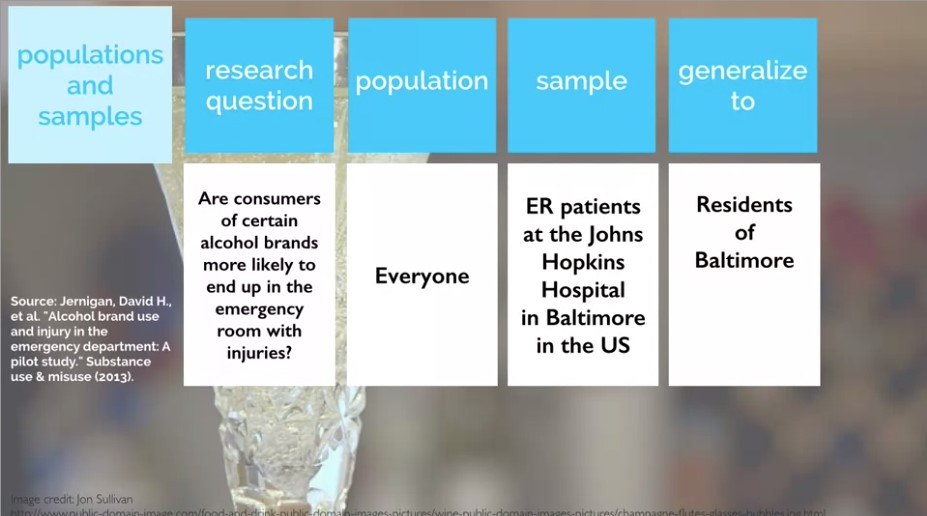
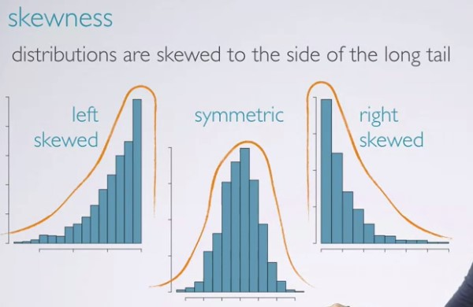

to view http://htmlpreview.github.io
To run r code
**shortcut is ctrl+alt+i**


# Introduction



**discrete numerical variable**: An accounted veriable that can only take on whole number values

**continuous numerical variable**: it can take on any number of values between two set of numbers


*hdi* is an **ordinal categorical variable**


# Sampling & sources of bias


# Experimental Design

Principles of experimental design


# Random Sample Assignment


**quiz**


**Shortcuts**

piping operator: ctrl + shift + m

assign operator: alt + -

# Assignment

```{r}
library(dplyr)
library(ggplot2)
library(statsr)
```


```{r}
data(arbuthnot)
dim(arbuthnot)
names(arbuthnot)
arbuthnot$boys
ggplot(data = arbuthnot, aes(x = year, y = girls)) +
  geom_point()
arbuthnot <- arbuthnot %>%
  mutate(total = boys + girls)
ggplot(data = arbuthnot, aes(x = year, y = total)) +
  geom_line()
ggplot(data = arbuthnot, aes(x = year, y = total)) +
  geom_line() +
  geom_point()
arbuthnot <- arbuthnot %>%
  mutate(more_boys = boys > girls)
```

```{r}
data(present)
dim(present)
```

Calculate the total number of births for each year and store these values in a new variable called total in the  present dataset. Then, calculate the proportion of boys born each year and store these values in a new variable called prop_boys in the same dataset. Plot these values over time and based on the plot determine if the following statement is true or false: The proportion of boys born in the US has decreased over time.

True

False
```{r}
present <- present %>% 
mutate(total = boys + girls)%>% 
mutate(prop_boys = boys/total)

ggplot(data = present, aes(x = year, y = prop_boys)) + geom_line()
```

Create a new variable called more_boys which contains the value of either TRUE if that year had more boys than girls, or FALSE if that year did not. Based on this variable which of the following statements is true?

Every year there are more girls born than boys.

Every year there are more boys born than girls.

Half of the years there are more boys born, and the other half more girls born.

```{r}
present <- present %>%
mutate(more_boys = boys > girls)

ggplot(data = present, aes(x = year, y = more_boys)) + geom_line()
```


Calculate the boy-to-girl ratio each year, and store these values in a new variable called prop_boy_girl in the  present dataset. Plot these values over time. Which of the following best describes the trend?

There appears to be no trend in the boy-to-girl ratio from 1940 to 2013.

There is initially an increase in boy-to-girl ratio, which peaks around 1960. After 1960 there is a decrease in the boy-to-girl ratio, but the number begins to increase in the mid 1970s.

There is initially a decrease in the boy-to-girl ratio, and then an increase between 1960 and 1970, followed by a decrease.
The boy-to-girl ratio has increased over time.

There is an initial decrease in the boy-to-girl ratio born but this number appears to level around 1960 and remain constant since then.

```{r}
present <- present %>%
mutate(prop_boy_girl = boys/girls)

ggplot(data = present, aes(x = year, y = prop_boy_girl)) + geom_line()
```


# Week 2: Visualizing numerical data





