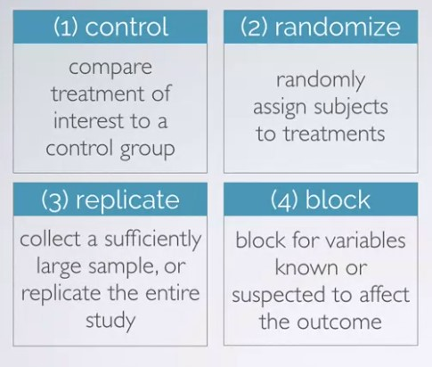

to view http://htmlpreview.github.io
To run r code
**shortcut is ctrl+alt+i**

# Introduction

**discrete numerical variable**: An accounted veriable that can only take on whole number values

**continuous numerical variable**: it can take on any number of values between two set of numbers

*hdi* is an **ordinal categorical variable**

# Sampling & sources of bias

# Experimental Design

Principles of experimental design

